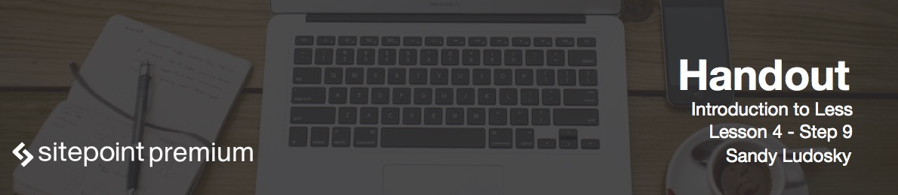

#Lesson Files
You can find the lesson files for this lesson [here](https://github.com/learnable-content/introduction-to-less/tree/lesson1.1/intro%20to%20less%20-%20code%20samples/lesson3.9)


# Customizing Footer

In this step we will customize the footer and that's going to be the last part for this course.

We're going to be using the exact same mixin that we used initially for the navigation:

```less
#footer {
	.bar;
	text-align: center;
}
```

The only thing that I had to redefine is `text-align` property to align the text correctly.
