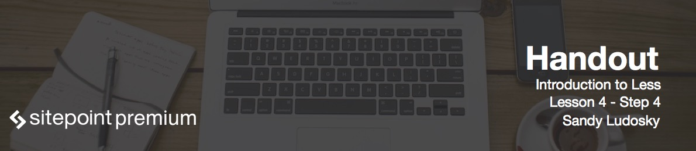

#Lesson Files
You can find the lesson files for this lesson [here](https://github.com/learnable-content/introduction-to-less/tree/lesson1.1/intro%20to%20less%20-%20code%20samples/lesson3.4)


# Introduction

So now we're going to style the "Our Services" section.

# Styling Service section

We're going to be using the *mixins.less* file inside of which I have declared a group of code under the namespace `commonRules`.

Go ahead and apply it to the `#work` section while changing the background as well:

```less
#work {
	#commonRules;
	background: @light;	
}
```

And that's it - refresh the page and observe a result. That was a good demonstration that with Less you can do a lot of things by writing much less code.
